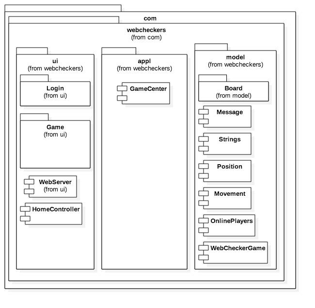
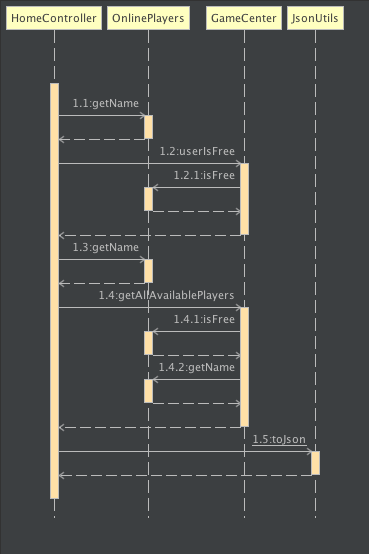
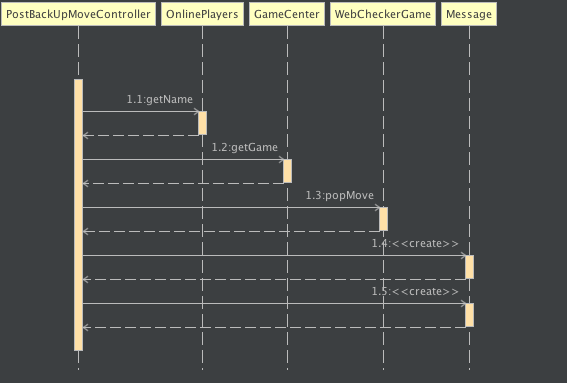
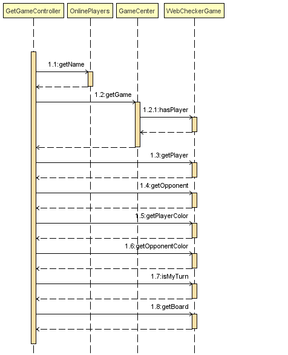

PROJECT Design Documentation

# Executive Summary

The Web Checkers is a web based game, which must allow players to play checkers with other signed-in players. The game user interface (UI) will support drag-and-drop browser capabilities for making moves according to the American rules.

## Purpose

The purpose of this Design Document is to describe the Web Checkers system and its implementation by showcasing the high level description of the architecture and its components. The Web Checkers is a web application designed to allow players to log in to the system and play Checkers game as per the American rules.

## Glossary and Acronyms

<table>
  <tr>
    <td>Term</td>
    <td>Definition</td>
  </tr>
  <tr>
    <td>Player</td>
    <td>The is the user who will play the game of checkers</td>
  </tr>
  <tr>
    <td>Account</td>
    <td>Each player has an account</td>
  </tr>
  <tr>
    <td>Game Rules</td>
    <td>The Web Checker has a set of rules which will be followed by the game</td>
  </tr>
  <tr>
    <td>Game</td>
    <td>The Game is the domain which combines board and game rules to the player</td>
  </tr>
  <tr>
    <td>Board</td>
    <td>Board is an entity on which the game is played</td>
  </tr>
  <tr>
    <td>Movement</td>
    <td>Movement is the made by the player on a disk. </td>
  </tr>
  <tr>
    <td>Disk</td>
    <td>Disk is the entity that is to be moved by the player in each game. </td>
  </tr>
  <tr>
    <td>Disk Color</td>
    <td>The disk can be of two colors, RED and WHITE</td>
  </tr>
  <tr>
    <td>Squares</td>
    <td>Squares are the spaces in the board on which the user places or removes the disks. </td>
  </tr>
</table>

# Requirements

## Definition of MVP

The minimal viable product includes these features:

1. Every player must sign-in before playing a game.

2. Two players must be able to play a game of checkers based upon the [American rules](http://boardgames.about.com/cs/checkersdraughts/ht/play_checkers.htm).

3. Either player of a game may choose to resign, which ends the game.

## MVP Features

These are the features that we have implemented and tested in our Sprint 3

* As a Player I want to start a game so I can challenge other online players.

    * The player can pick an opponent from a list of all players signed-in that are not currently playing a game.

    * This selection launches the Game view that includes a complete 8x8 grid with the initial piece layout.

    * Sends the player back to the Home page if the requested opponent is already engaged in a game.

* As a Player I want to sign-in to play online checkers.

    * A player can navigate to the Signin page from the Home page.

    * A player can enter their name and create a gaming session.

    * The system must reject any sign-in using an existing name.

    * A player can sign-out, which ends that player's session and frees up the name.

    * The system will not persist player information. Furthermore, a given player name is first-come-first-serve. When the player signs-out the name is released for another player to use.

* As a player, If it's not my turn, I shouldn’t be able to move my disk. 

    * **Given** that is not my turn **When** I attempt to play **Then** I am expected to see a message saying _it's opponent_name turn_ and not allowed to move my piece.

    * **Given** that is my turn **When** I attempt to play **Then** I am expected to see a message saying that _it's my turn_ and allowed to move my piece.

* As a Player, If i am assigned red color, then i am supposed to make the first move.

    * GIVEN that I want to play with a particular opponent WHEN i press the play button first THEN the system assigns me the red colour discs

    * GIVEN that I am assigned the red color discs, WHEN the game starts THEN I should be able to make the first move.

    * GIVEN that I am assigned the white colour discs, WHEN the game starts, THEN I should not be able to make the first move.

* As a Player, I should be able to move my disc in the forward direction diagonally, so as to be able to play the game. 

    * GIVEN its my turn, WHEN I make a legal movement on a single piece, THEN the system allows me to submit the turn and gives a message saying "Legal Move!"

    * GIVEN that is my turn WHEN I make any illegal move on a single piece THEN the system will display a message saying "Illegal Movement".

* As a Player, I should be forced to capture the opponent’s disk , if there is a possibility. 

    * **Given** that I am in capture_mode **when** is my turn to play **then** I am expected to be forced to capture the opponent's piece.

* As a Player, I must leap over the opponent’s pieces in a straight diagonal line on the other side, so as to capture the opponent’s piece and remove it from the board. 

    * **Given** that I am able to make one capture **When** is my turn **Then** I am expected to jump against one opponent's piece and capture it. 

    * **Given** that I am able to make more than one capture **When** is my turn **Then** I must be free to choose which piece to capture.

    * **Given** that I am making a capturing move **When** I am playing **Then** the opponent's piece is expected to be removed from the board.

* As a player, when my disk reaches the opposite furthest end of the board, my disk becomes a king disk. 

    * GIVEN that I move a single piece WHEN I reach the last space on the opposite side of the board, THEN the piece is expected to become a king.

* As a Player, I should be able to move my King disc in both forward and backward direction diagonally, so as to be able to play the game.

    * Given its my turn, when I make a legal movement on a king piece, the system allows me to submit the turn and gives a message saying "Legal Move!"

    * GIVEN that is my turn WHEN I make any illegal move on a king piece THEN the system will display a message saying "Illegal Movement". 

* As a Player, I should be able to capture all the opponent’s disc, so that I win the game

    * when I capture all the opponent's disk, i should be the winner

    * when I am the winner, the game should end

    * when the game ends, the system should take me to the homepage.

    * when all my disks are capture, my game should be lost

    * when i lose, the game should end

* As a Player, If I am not able to move any of my discs, The game should end and I should be the loser.

    * When I am not able to move any piece, the game should be over and I should be the loser

    * when I have lost the game, i should be redirected to home

    * if my opponent is not able to move any piece, the game should be over and i should be the winner

    * when I have won the game, I should be redirected to home.

* As a Player, I should be able to resign the game at any point, so as to end the game.

    * GIVEN that I am on an active game WHEN I click on the resign option THEN I am expected to see a warning message.

    * GIVEN that I confirm to resign the game WHEN I am shown the warning message THEN I am expected to have my status changed to free and redirected to the home page.

# Application Domain

This section describes the primary domain areas of the project. 

For the Webchecker game, players need to sign-in with their account in order to play and each player can compete against another player. The game is played by moving the disks using the game rules(American checkers rules), where there is an 8X8 board consisting of 64 squares of alternating black and white colors. Each player is assigned 12 disks of either red or black color and these disks are placed on the squares and the game can be started.

## Overview of Major Domain Areas

### Player

A player is a user in our application. Each player has a unique name and cannot be empty. For the game to be played, there have to be 2 players who are not currently in a game. 

### Game

The game is where the user plays, this has all the logic which is derived from the Game Rules. The game will be interacted by two users and they will have information about all the game elements. 

### Rules

The rules domain is how the game decides its various states and show it to a user. Every Time the game is turned, the game checks the rules and decides the possible movements for the player to make. The rules has move validations, disk conversions, and capture scenarios. It also contains the game ending scenarios and reports it to the game. 

# Architecture

In Sprint 3, we have used the following technologies:

* Spark Framework

* FreeMarker Template

* Maven Template

* Java 8

* Json

Our Architecture contains the following components.

* Client UI, which contains the css, javascript and generated HTML. 

* Server UI, which contains the FTL files, and the UI Java classes which acts as a controller for the GET and POST methods, it also sends the data to the ftl files. 

* Application, where our game logic and login logic is going to exists. 

* Model, which will contain the data for the board, rows, spaces and pieces and the player’s information. 

## Summary

Our game architecture consist of three tiers( UI, Application, Model) and three layers( Framework, Platform, OS/Hardware). UI tier is basically responsible for the interaction with the user. Client and Server UI interacts with each other once the network connection is established. They interacts with each other through http connection by using different verbs such as GET, POST, PUT etc. Client UI consists of three layers out of which we have used HTML, JAVASCRIPT and CSS in framework layer. User can run in any browser( platform layer) and in any OS(os/hardware layer). We have used spark and freemarker template engine in server UI framework layer. Similarly, java webserver jetty is used in the platform layer. Any OS supports server UI.

Application tier is responsible for holding the logic that controls the overall flow of application. We have used spark as a framework and java webserver(Jetty) as a platform. Gamecenter class is an example that lies under Application tier. It interacts with the UI and Model tier.    

Model tier is basically responsible for managing and storing different data. It holds different business logic. It has java webserver(Jetty) as a platform layer and any os as os layer. Board, Online Players are some examples under model tier.

Diagram below shows the architectural diagram of the Guessing Game

## Overview of User Interface

When the user goes to our application, the home screen is presented which will allow the user to sign in. When the user presses the sign-in button, the system presents the login page where the user can enter a unique name for himself. If the details entered by the user is empty or if the name is already taken, appropriate error messages will be shown. When the user enters a unique name, the system will show the home page, this time showing all the players that are available to play. The user can then select a player and press the play button which starts the game for both the player and the opponent he/she wants to play. The player will start the game first and the opponent will be in the waiting state. The player can select any piece which he/she owns and move it in the board. The board validates the move once the player has made a move. If there is an illegal movement, the piece will come back to its original position giving errors, else it will show the valid message and the piece can be moved. The player can either backup the move or reset the move, or submit the move. When the player submit the move, the move is committed and the player is in the waiting state, and the control moves to the opponent. This goes on and on until the game ends, wherein the system shows the user who has won and who has lost. Any player can select the go home button to delete the game from the system and the system will take him/her to the home screen so that they can play another game. The user can also log-out of the system which frees the name for another user to use. 

## UI

UI deals with user by using different verbs such as GET, POST, PUT, DELETE etc. It also prevents the direct interaction of user with the application and model tires. GAME UI, LOGIN UI, Homecontroller UI are some examples in our project.

## Application

The application package is responsible for managing user’s interaction with the application. Classes under application tier are responsible for performing logical operation. Application tier provides service to the user by producing different results based on the data available in Model tier. So, it interacts directly with and application tier. Game Center class lies under the Application tier.

## Model

Model tier is responsible for handling and storing different data. In other words, it is responsible for managing domain entities and domain logic. Model tier also takes care of value and entity objects.  Board, Online Players are some examples that are under model tier in our project.

# Subsystems

## Application

### Purpose

The purpose of the Application tier is to connect the UI subsystem and the Model subsystem. This acts as a middle tier between the user interaction and the model. 

1. GameCenter -

    1. The Game Center is the class which contains the information about all the users in the system and all the games in the system. It also has helper functions to get the user, the game, login, logout, start the game, end the game and getting the current state of the game. 

## UI 

### Purpose

The UI controller acts as the supplier of the information from the model to the views. 

UI Contains the following subsystem:

1. Game

    1. GetGames Controller - Gets the game page and its state to the view. 

    2. PostBack Move Controller - A POST method which returns a message after doing an undo of a movement. 

    3. PostCheck Turn Controller - A POST method to check if is the current player’s turn. 

    4. PostSubmitTurn Controller - A POST method which commits the movement made by the player. 

    5. PostValidate Move Controller - A POST method to Check if the move is legal or illegal or if the move is in capture mode or not. 

    6. StartPlay Controller - A POST method which starts the game for the player and the requested opponent and redirects to the game page. 

2. Login

    7. Get LogInController - GET method for the sign in page

    8. Get SignOut Controller - GET method for Signing out and redirecting to the homepage. 

    9. Post LogInController - Controller for POST/signin

3. HomeController -Acts as the Web Controller for the Home page.

## Model (Deals with various data)

1. Board

    1. Board - Consists of 8 rows. 

    2. Piece - Consists of the type of the piece {SINGLE, KING} and color {RED, WHITE}

    3. Row - Consists of 8 spaces

    4. Space - Each Space has a color and pieces sits on it. 

2. Message - Has a type and text which is sent to the UI. 

3. Movement - Stores the movement and its start and end positions

4. Online Players - Has the information about a player - contains the player name and a boolean if it is free.

5. Strings - All the string literals exists, all the class reference to get the attributes, messages and file names.

6. WebChecker Game - Class of the game and its functions. It holds the boards, the players and all the states, validations and movements. It also determines when the game is over and when the pieces is to be taken out.

# Static models

## Class Diagram 

Our class diagram is divided into different sections describing each kinds of classes and each classes for many cases. Let's go by them one by one. 

The Piece Has type and color. Space contains either 1 or none Piece. Space has a color. Row has many Spaces. 

Board has many rows. 

The WebChecker Game has conversion State and movement State. It also has one Board, many Movements, and many Positions. 

The Game Center has many WebChecker Games and many Online Players. 

Each Controller in the UI package has one and only Game Center. As the structure for all the controllers is almost the same, we haven’t shown all of them. 

The WebServer has instances of all Controllers and the Application has only one Web Server. And this is how the class is dependent on in a hierarchical way. 

## Component Diagram 

## Package Diagram 

# Dynamic Models

## Statechart Diagram

## Sequence Diagrams

These are the various Sequences for various call functions made from the user to the internals of the project. 

HomeController.handle()

PostSign Controller.handle()

StartPlay Controller.handle()

Post BackUp Move Controller.handle()

Post Submit Turn Controller.handle()

GetGameController.handle():

